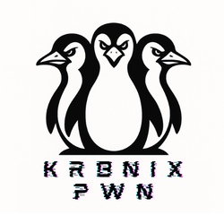
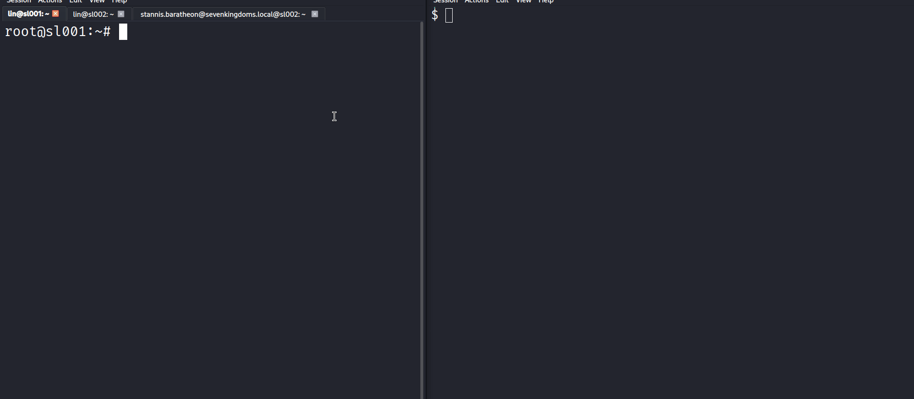
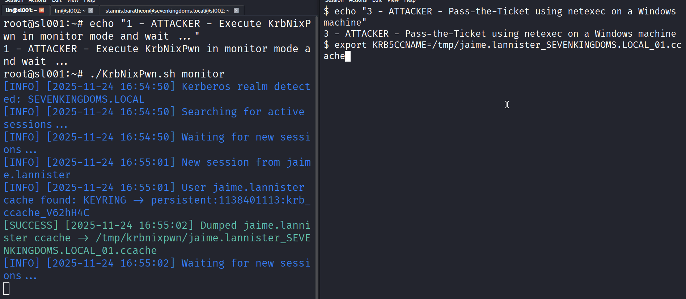
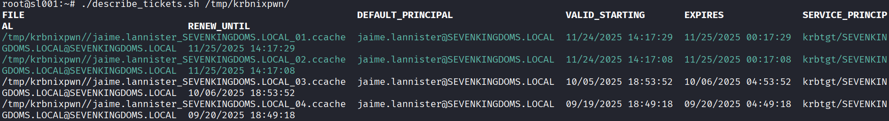
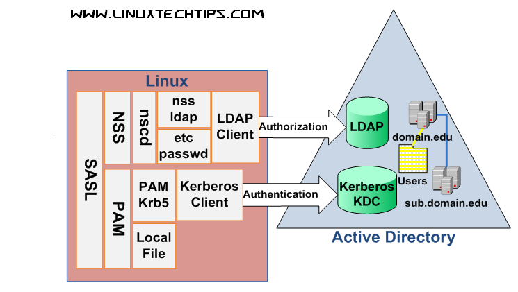
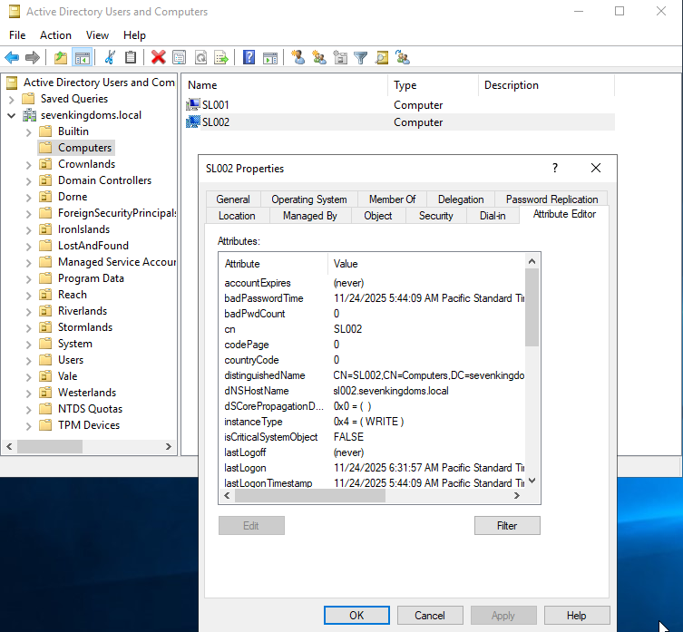
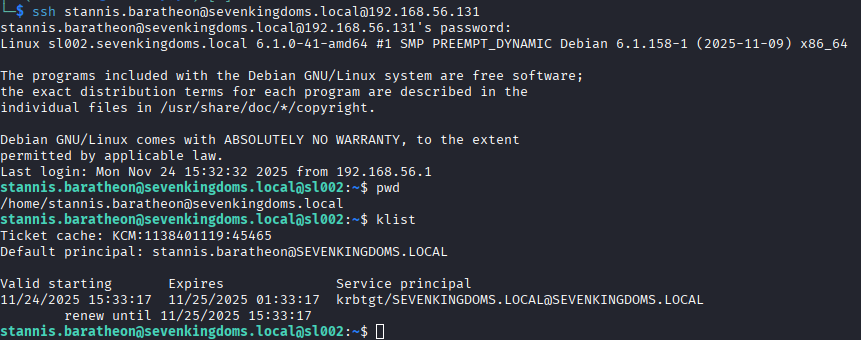

#### A Native Bash Framework for Kerberos Ticket Extraction on Linux

> **KrbNixPwn is a all-in-one Kerberos ticket extraction framework designed to support red-team operations across diverse Linux enterprise environments.** Its purpose is to simplify data collection from heterogeneous Kerberos cache backends (FILE, DIR, KCM, KEYRING) while mitigating the operational friction typically associated with legacy or single-purpose tools.

#### TL;DR — Using KrbNixPwn
**Search for and dump all Kerberos tickets on the machine (requires root privileges):**

    ./KrbNixPwn.sh dump
    
**Monitor and automatically dump Kerberos tickets from current and subsequent user sessions (requires root privileges):**

    ./KrbNixPwn.sh monitor
------------

- [Motivation](#motivation)
- [Usage](#usage)
  * [Options](#options)
  * [Demo](#demo)
  * [Utils](#utils)
- [Technical Background](#technical-background)
  * [Abstract](#abstract)
  * [Active Directory Integration](#active-directory-integration)
  * [FreeIPA/IDM Integration](#freeipaidm-integration)
  * [Hybrid (Trust-Based) Integration](#hybrid-trust-based-integration)
  * [Caching Mechanisms](#caching-mechanisms)
    + [FILE Cache](#file-cache)
    + [DIR Cache](#dir-cache)
    + [KCM (Kerberos Cache Manager)](#kcm-kerberos-cache-manager)
    + [KEYRING Cache](#keyring-cache)
  * [Security Implications](#security-implications)
- [Playground: Integrating Linux machine into GOAD](#playground)
- [References](#references)

### Motivation
Linux systems are increasingly required to participate in enterprise identity management infrastructures alongside Windows environments, **making Kerberos-based authentication ubiquitous in hybrid environments**. However, while Windows red-team tooling (e.g., Rubeus) is mature, Linux Kerberos tooling remains fragmented :
- Existing tools are task-specific, each supporting only one cache mechanism or limited extraction logic.
- Many rely on Python or heavy external libraries, which is not always acceptable in restrictive red-team contexts.
- Most operate in a one-shot fashion, unsuitable for long engagements where new user sessions appear over time.

**KrbNixPwn was developed to address these gaps:**
- **Unified toolchain** supporting all major cache backends.
- **Zero-to-minimal dependencies** through pure Bash + coreutils.
- **Monitoring mode** for long-term persistence and automatic extraction of new Kerberos sessions (like [Rubeus monitor](https://github.com/GhostPack/Rubeus?tab=readme-ov-file#monitor "Rubeus monitor")).

 

### Usage
#### Disclaimer
KrbNixPwn is provided strictly for **educational**, **research**, and **authorized security testing** purposes.
Unauthorized use of this tool against systems you do not own or do not have explicit permission to test is illegal.

#### Options
> KrbNixPwn provides two operational modes — **dump** and **monitor**.

Basic Command Structure : 

    ./krbnixpwn.sh [dump|monitor] [-o output_dir] [--verbose] [--help]

- **dump** Search through typical Kerberos cache locations (FILE, DIR, KCM, KEYRING) and retrieve all identifiable credentials and keytabs.
- **monitor** Watch for new user logins in real time and attempt extraction when new Kerberos sessions appear.
- **-o or --output** Specify a custom directory to store extracted .ccache or .keytab artefacts. Default: */tmp/krbnixpwn.*
- **-v or --verbose** Enable verbose debugging output.
- **-p or --printout** Displays the ticket content in base64 after saving it (useful when you cannot extract files from the remote machine).
- **-r or --runfor** Specifies a timeout after which the script terminates itself in monitor mode (note that it does not clean up output files).

#### Prerequisites
**You must run the script as root (or with a sudo user)** - KrbNixPwn needs access to Kerberos caches, keyrings, and SSSD internal files belonging to other users.
These resources are only readable by the root user.

**The script relies on common, standard Linux utilities** - Note that all major enterprise Linux distributions (Ubuntu, Debian, RHEL, Fedora, SUSE) include all of these binaries by default when joined to a domain.
- bash
- klist
- awk/sed/grep
- su/sudo
- keyctl (if KEYRING caching mode)
- hexdump or od or perl (falls back automatically if missing)

#### Demo
> Scenario: we have compromised the machine sl001@sevenkingdoms.local. 

1. We launch KrbNixPwn in “monitor” mode and wait patiently for someone to log in. As soon as the victim logs in, their ticket is automatically extracted.

2. We can perform a pass-the-ticket attack from attacker machine to impersonate the user in Active Directory (e.g with **[netexec --use-kcache](https://www.netexec.wiki/getting-started/using-kerberos)** option).

#### Utils
The [utils](https://github.com/onSec-fr/KrbNixPwn/tree/master/utils "utils") directory contains additional scripts designed to facilitate the analysis and practical use of Kerberos credentials extracted by KrbNixPwn.  
> **describe_tickets.sh** summarizes Kerberos credential caches (.ccache files) in a directory in a human-readable table, including principal, service principal, validity period, and renewal information. **Tickets that are still valid (expiration > current time) are highlighted in green for quick identification.**

Usage : `./utils/describe_tickets.sh /path/to/ccache_dir`

> **ssh_kerberos_exec.sh** executes SSH commands on multiple hosts using Kerberos authentication (GSSAPI) without relying on passwords. Ideal for post-extraction testing where a valid ticket is available.  

Usage : `./utils/ssh_kerberos_exec.sh -f <hostfile> -u <user@domain.com> -c "<command>"`

 

### Technical Background
#### Abstract
Linux systems can integrate with Microsoft Active Directory or FreeIPA/IDM, either directly or through trust relationships, enabling single sign-on (SSO) and consistent identity management across platforms.

Here is a diagram from linuxtechtips.com that illustrates a typical integration :

#### Active Directory Integration
Linux machines integrate with AD primarily through the following mechanisms:
- Kerberos Authentication: Linux clients authenticate against the AD Kerberos Key Distribution Center (KDC) to obtain tickets for access to network resources.
- LDAP for Directory Queries: Lightweight Directory Access Protocol (LDAP) allows Linux systems to query AD for user attributes and group membership.
- SSSD (System Security Services Daemon): SSSD acts as a mediator between Linux PAM/NSS and AD, providing caching, offline authentication, and enhanced performance.

#### FreeIPA/IDM Integration
FreeIPA and Red Hat IDM provide a Linux-native identity management solution combining LDAP, Kerberos, DNS, and certificate management. Linux clients interact with FreeIPA servers using:
- SSSD for NSS/PAM integration.
- Kerberos for authentication.
- LDAP for directory queries.
- Certificate-based authentication for TLS-secured communication.

Clients are enrolled via ipa-client-install, which configures SSSD, Kerberos, and NSS/PAM automatically.

#### Hybrid (Trust-Based) Integration
It is possible to integrate Linux clients in environments with both AD and FreeIPA/IDM through trust relationships:
- **AD ↔ FreeIPA trust:** Allows users from one domain to authenticate in another domain.
- Linux machines can authenticate against AD users via SSSD using the IPA/IDM trust as a bridge.

> This setup requires correct Kerberos realm configuration, cross-realm trust, and proper mapping of POSIX attributes.

#### Caching Mechanisms
**Here is what interests us most from a red team perspective** - Both AD and IPA rely on the standard MIT Kerberos implementation on Linux, which exposes different cache formats depending on configuration :

##### FILE Cache
The oldest and most straightforward cache format:`FILE:/tmp/krb5cc_%U`
- Default for many traditional Kerberos workflows (e.g., kinit, non-SSSD environments).
- Stores credentials as a single ccache file.
-  Easiest format to extract and reuse.
- Still widely encountered in manually joined AD hosts and legacy systems.

##### DIR Cache
A hierarchical directory-based cache supporting multiple simultaneous credential sets.
Common format : `DIR:/tmp/krb5cc_%U`  
- Contains a primary file referencing the active ccache entry.
- Used when processes require isolated credentials (e.g., GSSAPI multiplexing).
- Extraction requires resolving the directory structure, not just copying one file.

##### KCM (Kerberos Cache Manager)
A more modern back end used mainly when SSSD is deployed. KCM stores credential material inside the SSSD secrets database : **/var/lib/sss/secrets/secrets.ldb**.  
- This format is significantly more complex and requires reconstructing ticket structures from binary blobs.  
- Since SSSD 2.0.0 (2018-08-13), the KCM back-end no longer encrypts the secrets database — meaning ticket blobs are present in cleartext inside secrets.ldb.
- Increasingly common on AD-joined Linux desktops and servers using realmd/SSSD.

##### KEYRING Cache
The KEYRING cache type stores Kerberos tickets securely in the Linux kernel keyring, a protected in-memory storage mechanism. Unlike file-based caches, the credentials are never written to disk in plain text. Tickets in the keyring are isolated per user session and cleared automatically on logout or system reboot. Access is controlled by kernel permissions, making it much harder for unprivileged processes to extract credentials.
- Tickets are never written to disk in plaintext.
- Access is restricted via kernel-level permissions.
- Contents vanish on logout or reboot.
- Extraction requires interacting with keyctl and parsing proprietary key structures.

#### Security Implications
With root access, **Kerberos tickets cached by any user can be extracted**. Unlike on Windows, this does not require performing noisy or intrusive actions that would typically trigger EDR detection. In FILE or DIR cache modes, retrieving the ccache files is straightforward. In KCM or KEYRING modes, extraction remains entirely feasible using the appropriate techniques.  
**KrbNixPwn automates all of these workflows, handling each cache backend transparently and without operator intervention.**

**Cross-platform attacks : Linux ↔ Windows**
- Kerberos on Linux (MIT Kerberos) uses ccache files, while Windows uses kcache / kirbi formats.  
- Despite this difference, the actual Kerberos ticket data (encrypted TGT/TGS blobs) are compatible.

A Linux-dumped ticket can be:
1. Extracted from FILE/DIR/KCM/KEYRING.
2. Converted into .kirbi format using standard converters (e.g., [impacket ticketConverter](https://github.com/fortra/impacket/blob/master/examples/ticketConverter.py "impacket ticketConverter")).
3. Imported into Windows tooling such as Rubeus or Mimikatz for pass-the-ticket operations.

**Thus, Linux-side Kerberos compromise directly enables Windows lateral movement.** The opposite is also possible if GSSAPIAuthentication is enabled in sshd.

 

#### Playground
**This section demonstrates how to integrate a Linux machine into the great [GOAD](https://github.com/Orange-Cyberdefense/GOAD "GOAD") lab.**

##### Option 1 - Use GOAD Lab lx01 extension
GOAD provides a Linux host extension — lx01 — which automates the deployment and domain join process: https://orange-cyberdefense.github.io/GOAD/extensions/lx01/
> This is the easiest and cleanest way to add add a linux ubuntu 22.4 to the lab GOAD or GOAD Light in the domain sevenkingdoms.local.

##### Option 2 - Manual integration into GOAD Lab

> The manual procedure is good for users who want to understand the underlying steps and how the different components work (SSSD, realmd, Kerberos, DNS, system configuration, etc.).
This approach is valuable if you want to learn what happens behind the scenes, troubleshoot issues, or adapt the setup to other environments.

**The manual procedure below is based on Debian 12, as it provides a clean and stable baseline for AD integration with SSSD/realmd. Other distributions may require adjustments.**

1. Before joining the domain, ensure your machine has a proper hostname and FQDN : `sudo hostnamectl set-hostname <machine_name.sevenkingdoms.local>`

2. Install all required packages for AD integration, SSSD, Kerberos, and authentication : `sudo apt update && sudo apt install realmd sssd samba-common krb5-user adcli libsss-sudo sssd-tools sssd-kcm libsasl2-modules-ldap packagekit libpam-mount`

3. Active Directory relies on DNS. Edit /etc/resolv.conf to point to the domain controller : `vi /etc/resolv.conf`

*Exemple* :

    nameserver 192.168.56.10
    search sevenkingdoms.local

> Note: If you want this configuration to persist, consider disabling NetworkManager or updating its config.

4. Discover the AD realm : `realm discover SEVENKINGDOMS.LOCAL`
> This shows realm info, KDC, and configuration details.

5. Join the machine in the AD domain (requires AD user with machine join privileges) : `sudo realm join --user=Administrator SEVENKINGDOMS.LOCAL`

6. Verify the integration
- List the joined realm: `realm list`
- Check an AD user can be resolved via SSSD: `id jaime.lannister@SEVENKINGDOMS.LOCAL`

*Exemple output*

    uid=1138401113(jaime.lannister@sevenkingdoms.local) gid=1138400513(domain users@sevenkingdoms.local) groups=1138400513(domain users@sevenkingdoms.local),1138400512(domain admins@sevenkingdoms.local),1138400572(denied rodc password replication group@sevenkingdoms.local),1138401105(lannister@sevenkingdoms.local)

7. Configure PAM for home directories : `pam-auth-update` and enable at minimum:
- SSS authentication
- Create home directory on login

8. Grant login permissions
- Allow all AD users to login: `sudo realm permit --all `
- Or restrict to a specific group: `sudo realm permit "Domain Admins"`

9. Kerberos configuration - edit `/etc/krb5.conf`
> Note that it is not necessary to manually define the Kerberos realm information if the DNS is configured correctly, but this allows us to better control and understand how it works under the hood.

*Sample configuration to use*

    [libdefaults]
    udp_preference_limit = 0
    default_realm = SEVENKINGDOMS.LOCAL
    #default_ccache_name = KEYRING:persistent:%{uid}
    default_ccache_name = KCM:
    #default_ccache_name = DIR:/tmp/krb5cc_%U
    #default_ccache_name = FILE:/tmp/krb5cc_%U
    default_realm = SEVENKINGDOMS.LOCAL
    dns_lookup_realm = true
    dns_lookup_kdc = true
    
    [realms]
     SEVENKINGDOMS.LOCAL = {
      kdc = kingslanding.sevenkingdoms.local
      admin_server = kingslanding.sevenkingdoms.local
     }
    
    [domain_realm]
     .sevenkingdoms.local = SEVENKINGDOMS.LOCAL
     sevenkingdoms.local = SEVENKINGDOMS.LOCAL

10. Test SSH login with AD credentials
You can now login with `ssh stannis.baratheon@sevenkingdoms.local@<linux_machine>`
- Enter the user password from AD (*Drag0nst0ne*).
- Successful login confirms both Kerberos and SSSD integration.
- Confirm with a `klist`

11. Play with configuration
**Once your Debian machine is integrated into the domain, you can customize authentication behavior and ticket caching, as well as restrict login and sudo access.**
- Modify Kerberos cache methods : edit `/etc/krb5.conf`, uncomment one of the *default_ccache_name* line then restart `systemctl restart sssd`.
- You can limit which AD users or groups can login using `sudo realm permit "Domain Users" `.
- You can restrinct sudo access via SSSD by creating rules in **/etc/sudoers.d/sssd**.

 

#### References
This research and development would have been much more difficult without the involvement of the community :
- https://swisskyrepo.github.io/InternalAllTheThings/active-directory/ad-adds-linux/
- https://cloud.google.com/blog/topics/threat-intelligence/kerberos-tickets-on-linux-red-teams
- https://github.com/synacktiv/kcmdump
- https://github.com/blacklanternsecurity/KCMTicketFormatter
- https://github.com/Hakumarachi/keyringCCacheDumper